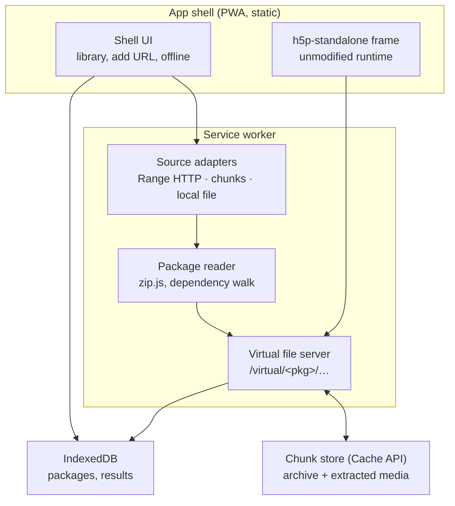

# H5P offline player — architecture

Browser-only H5P player for arbitrary `.h5p` archives fetched from the internet. No server-side code.

## Constraints

- Static hosting only (any CDN / GitHub Pages). No proxy, no backend.
- No OPFS. Single storage primitive: Cache API chunks.
- Nothing larger than one chunk (8 MB) is ever held in memory. Everything streams.
- Learner results never leave the device.
- Archives are untrusted and arbitrary: any compression method, any media size, any content type.

## Overview

## Components

### 1. Shell
Static PWA (manifest, Home Screen install prompt — required on iOS for storage that survives the 7-day eviction).
Package library, add-by-URL, one-off local file pick, offline manager (download, progress, quota check via `navigator.storage.estimate()`, delete), in-app-browser detection with "Open in Safari" fallback.
Never touches package bytes.

### 2. Source adapters
One interface: `size` + `read(offset, length)` (matches the zip.js `Reader` contract). The local-file adapter is the plugin slot.

| Adapter | When | Storage |
|---|---|---|
| Range HTTP | Host sends CORS + `Accept-Ranges: bytes` | None until user saves offline |
| Chunked | Host has CORS but no Range; or package saved offline | Archive in chunk store |
| Local file | User picks a `.h5p` | None; `File.slice()`, session only, re-sent to the worker on restart |

Host without CORS: cannot be loaded from the browser. Tell the user to download the file and open it locally.

### 3. Package reader
zip.js `ZipReader` over a source adapter. Reads the central directory, builds the entry index, reads `h5p.json`, walks `preloadedDependencies` only (editor libraries ignored), assigns a serving strategy per entry.

### 4. Virtual file server (Service Worker)
Route `/virtual/<pkg>/…`. Strategy per entry:

| Entry | Strategy |
|---|---|
| Small (< ~16 MB) | Extract once → Cache API → serve |
| Large, stored (method 0) | Slice the source directly; no extraction, no storage |
| Large, deflated (method 8) | One-pass extraction into chunk store; serve Range from chunks while extraction runs |

Full Range semantics: `206`, `Content-Range`, `Content-Length`, suffix ranges (`bytes=-N`). Requests outside `/virtual/` pass to the network (YouTube, external media).
Also hosts the `setFinished` and `contentUserData` endpoints h5p-standalone expects.
Stateless: on worker restart, rebuilds the index from the source (chunk store, or the `File` re-sent by the page).

### 5. Runtime
h5p-standalone frame bundle, unmodified, pointed at `/virtual/<pkg>`.

### 6. Storage
- Cache API: one cache per package, fixed 8 MB chunks keyed `<pkg>/<entry>/<n>`. Holds downloaded archives and extracted deflated media. A Range request is chunk arithmetic plus a slice.
- IndexedDB: package metadata (source URL, size, chunk size, status) and learner results.

### 7. Results
xAPI statements via `H5P.externalDispatcher`, plus the two Service Worker endpoints above → IndexedDB. Provides save-and-resume. Export as JSON.

## Flows

**Open** — URL → `HEAD` probe (CORS? Range?) → pick adapter → package reader builds index → dependency walk → register package with worker → h5p-standalone loads.

**Save offline** — stream archive into chunk store (resumable via Range when the host supports it) → optionally pre-extract deflated media → mark package offline-ready.

**Play** — runtime requests `/virtual/<pkg>/…` → worker serves by strategy → results to IndexedDB.

**Remove** — `caches.delete(<pkg>)` + delete metadata row.

## Out of scope
Editor, persistent local file handles (File System Access API), any server-side component.
