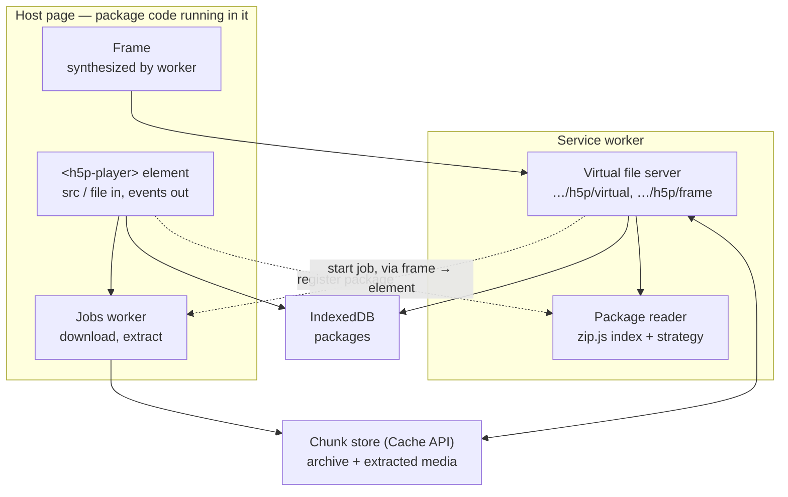

# H5P browser player — architecture

Browser-only H5P player for arbitrary `.h5p` archives fetched from the internet or picked from disk. No server-side code. v1 plays; deliberate offline management (save, list, delete packages) is deferred.

## Constraints

- Static hosting only (any CDN / GitHub Pages). No proxy, no backend.
- No OPFS. Single storage primitive: Cache API chunks.
- Nothing larger than one chunk (8 MB) is held in memory; every large transfer streams. Text entries (`.json`, `.js`, `.css`) are always treated as small because the runtime needs them whole.
- No long-running work in the Service Worker. Browsers terminate a worker event after roughly five minutes (Safari sooner), and a killed inflate cannot resume.
- No results storage and no offline management in v1. xAPI is exposed as events only. The chunk store is a cache, not a managed library: repeat playback is fast, and a package that was fully downloaded (chunked adapter) happens to play without network.
- Archives are untrusted and arbitrary: any compression method, any media size, any content type, possibly hostile.

## Overview



## Components

### 1. Element (`<h5p-player>`)
The package's public surface. Input: attributes and properties (`src` URL or `file` object, `sw`, `assets-base`). Output: events (`ready`, `xapi`, `finished`, `progress`, `error` with codes `no-cors | no-worker | network | quota | bad-archive | runtime`) and a `state` property (`idle | probing | downloading | indexing | ready | error`). Setting `src` or `file` loads, like `<video>`; setting it again aborts in-flight jobs for the previous package and reloads. It renders nothing but the frame iframe — no URL field, no file picker, no progress bar, no "open in Safari" banner. Those belong to the host page, which reacts to the events.

Internally it registers the Service Worker with an explicit scope `<swDir>h5p/` (or finds it already mounted), waits for *that registration* to reach `activated` (not `navigator.serviceWorker.ready`, which tracks the page's own controller and may never resolve for a nested scope), probes the source, writes the package descriptor to IndexedDB, tells the worker to index, and creates the iframe with `allow="fullscreen"`. The Jobs worker is spawned on first need. The element never touches package bytes.

**Host page** — anything that embeds the element: the repo's hosted player page, a third-party site, an LMS. Not part of the package. The hosted player page is deliberately minimal — a URL input, a file input, a progress bar wired to the events — and also serves `/embed` (see Security).

### 2. Source adapters
One interface: `size` + `read(offset, length)` (matches the zip.js `Reader` contract). `file` is built in; the adapter interface is the extension point for others.

| Adapter | When | What is stored |
|---|---|---|
| Range HTTP | Probe returns `206` | Not the archive; extracted entries are cached like any other |
| Chunked | Host has CORS but does not honour Range | Archive downloaded into the chunk store before play (the central directory sits at the end, so indexing needs the whole file) |
| Local file | Host page sets `file` | Not the archive (`File.slice()` on demand); extracted entries are cached like any other. The `File` is re-sent to the worker on restart |

**Probe:** `GET` with `Range: bytes=0-0`, aborted as soon as headers arrive (a host that ignores Range answers `200` with the whole body). Status `206` means the host honours Range. Total size comes from `Content-Range` when the host exposes it, otherwise from `Content-Length` of a plain `GET` aborted after headers (`Content-Length` is CORS-safelisted, `Content-Range` is not). A `HEAD` request proves nothing and is often blocked. Expect the chunked adapter to be common; Range HTTP is the optimisation.

The source descriptor (type, URL, size, ETag when exposed) is stored in the IndexedDB `packages` table so the worker can rebuild any adapter after a restart. Only the local-file adapter needs the page, which re-sends the `File` on request.

Host without CORS: cannot be loaded from a browser. The element reports `error: no-cors`; the host page tells the user to download the file and use `file`.

### 3. Package reader (Service Worker)
zip.js `ZipReader` over a source adapter. Reads the central directory, builds the entry index, normalises entry names (rejects `..`, absolute paths, backslashes, duplicates), assigns a serving strategy per entry.
No dependency walk: h5p-standalone resolves `preloadedDependencies` itself.

### 4. Jobs worker (page-side dedicated Worker)
All long-running work lives here, not in the Service Worker:
- download an archive into chunks when the host does not honour Range, or honours it but exposes no usable size (then the download is resumable with `Range: bytes=N-`);
- one-pass inflate of a deflated media entry into chunks, publishing a "bytes available" watermark as it goes.

Each job runs under `navigator.locks.request('h5p:<pkg>:<entry>')`, so two tabs playing the same package share one extraction instead of racing. Coalesces duplicate requests within a tab, reports progress to the element, which re-emits it as `progress` events. Started by the element (chunked adapter) or, when playback hits a cold deflated entry, by the Service Worker: it messages the requesting frame (`event.clientId` → `clients.get()`), the frame relays to its parent element, the element hands the job to the worker. No time limit; lives as long as the page.

### 5. Virtual file server (Service Worker)
Routes `…/h5p/virtual/<pkg>/…` (files), `…/h5p/frame/<pkg>` (synthesized frame document) and `…/h5p/virtual/_ping` (returns worker version; the element uses it to detect mounted routes and to warn on element/worker version mismatch). With our own registration the scope *is* `<swDir>h5p/`; with `mountH5P` the routes sit at `<hostScope>h5p/`. Same URL shape either way. Fast paths only:

| Entry | Strategy |
|---|---|
| Small (< ~16 MB) or text | Stream `getData()` straight into `cache.put()`, then serve |
| Large, stored (method 0) | Slice the source directly; no extraction, no storage |
| Large, deflated (method 8) | Serve from chunks. Cold or beyond the watermark → ask Jobs to start/continue. Reply with the prefix that *is* available as a shorter `206` (valid; the media element asks for the rest). Wait, bounded, only when nothing is available yet |

Every response carries a `Content-Type` derived from the entry's extension (CSS is ignored without `text/css`; Safari is strict about media types). Full Range semantics on media: `206`, `Content-Range`, `Content-Length`, `Accept-Ranges: bytes`, suffix ranges (`bytes=-N`). Requests outside these routes pass to the network (YouTube, external media).
Stateless: on restart, rebuilds adapters from the `packages` table and re-indexes.

### 6. Runtime (the frame)
The frame is the iframe document in which H5P content runs. H5P core assumes it owns the page (globals `H5P`, `H5PIntegration`, jQuery; global CSS; fullscreen and resize logic), so it gets its own document, as on h5p.org itself.

The frame document is **synthesized by the Service Worker**: a navigation to `…/h5p/frame/<pkg>` is answered from the `fetch` handler with a generated HTML page — no static file on the server. The page references the frame assets (h5p-standalone's `main.bundle.js` loader and `frame.bundle.js` with h5p.js, jQuery and the core runtime; `h5p.css`; the icon font — all unmodified) by URLs the element resolved with `new URL(…, import.meta.url)` (or from `assets-base`) and stored in `packages`. Scripts and CSS may come from any origin; only the document must be same-origin and in scope.

The generated page does three things: boots h5p-standalone against `…/h5p/virtual/<pkg>` with `embedType: 'div'`, `postUserStatistics: false` and `saveFreq: false`. Div embedding matters: with the default `iframe` type H5P core creates an inner `about:blank` iframe and writes the content into it, and whether such a child inherits the parent's Service Worker controller differs between browsers. With `div` the synthesized document *is* the H5P document — no inner frame, no inheritance question, and no result endpoints needed; forwards xAPI to the parent (`H5P.externalDispatcher.on('xAPI', …)` → `parent.postMessage`); carries a CSP `<meta>` generated from the registered asset origins (see Security). Resize messaging is built into h5p.js.

The element creates the iframe only after its registration is `activated`; otherwise the navigation would reach the server and 404.

### 7. Storage
- Cache API: one cache per package. Small entries stored whole under `<pkg>/<entry>`; archives and extracted media as fixed 8 MB chunks under `<pkg>/<entry>/<n>`. A Range request is chunk arithmetic plus a slice.
- IndexedDB: `packages` — `pkgId`, source descriptor, frame-asset URLs, status, sizes, `lastPlayed`.
- `pkgId`: hash of URL + `ETag`/`Last-Modified` when exposed, so a cached package is found again on the next visit; for local files, hash of name/size/mtime — the descriptor dies with the session, the caches persist and are found again when the same file is picked.
- The chunk store is a cache. Nothing in v1 lets the user manage it; when a `cache.put()` fails with a quota error, package caches are evicted oldest-`lastPlayed`-first — never the package currently being served — and the write is retried. Caches from an older major version are deleted on worker `activate`. Whatever survives makes the next playback of that URL fast and works without network — a side effect, not a feature.

### 8. xAPI passthrough
The frame forwards every xAPI statement to the parent; the element re-emits it as `xapi` and `finished` DOM events. Nothing is stored. Save-and-resume and result persistence are deferred to a future module that would subscribe to these events and, if needed, inject saved state into the frame.

## Flows

**Open** — `src` set → Range probe → adapter chosen → descriptor and frame-asset URLs written to `packages` → worker indexes → iframe navigates to `…/h5p/frame/<pkg>` → worker serves the generated frame → h5p-standalone walks dependencies and requests files.

**Play** — frame requests `…/h5p/virtual/<pkg>/…` → worker serves by strategy; a cold deflated entry triggers a Jobs extraction and is served progressively; xAPI flows out as events.

**Evict** (automatic, on quota error) — `caches.delete(<oldest pkg>)` + delete its `packages` row; retry the write.

## Security and deployment tiers

Content-type JavaScript runs on the frame's origin. A same-origin iframe isolates CSS and globals, not security.

- **Untrusted archives (any URL a user pastes):** use the hosted player page on its own origin (e.g. GitHub Pages). A hostile archive can then reach only the player's own data. Third-party sites reach it through `/embed?src=…`; on Safari, which blocks Service Workers in cross-origin iframes, `/embed` degrades to a link that opens the page directly.
- **Web component on a host site:** only for hosts that curate what they load. A hostile archive could read the host origin's IndexedDB, cookies and DOM.
- **Hardening in both:** CSP `<meta>` generated per frame response — `script-src 'self' <assets-base origin> 'nonce-<per-response>'` plus a short allowlist of CDNs that content types load at runtime (H5P.MathDisplay fetches MathJax from one); `style-src 'self' <assets-base origin> 'unsafe-inline'` because CKEditor-authored text carries `style="…"` attributes on nearly every field; `font-src 'self' <assets-base origin>`; `connect-src 'self'`; `object-src 'none'`; `base-uri 'none'`; `media-src`, `img-src`, `frame-src` left open for YouTube and external media. `connect-src 'self'` will block the few content types that fetch external data (subtitle files, remote JSON); accepted for v1. Entry-name normalisation (§3); zip.js kept current for malformed-archive fixes.

## Packaging

Distributed as one npm package, `@you/h5p-player`. Component 1 is the element; 3, 5 and 6 live in the Service Worker; 4 is a dedicated Worker bundled inside the element and spawned from a `blob:` URL. The host page is outside the package; the repo carries the hosted player page as its demo.

```
dist/h5p-player.js     <h5p-player> element + embedded Jobs worker — plays a package, nothing else
dist/h5p-sw.js         standalone Service Worker (self-contained IIFE)
dist/frame-assets/     main.bundle.js, frame.bundle.js, h5p.css, fonts — referenced via new URL(…, import.meta.url)
dist/index.d.ts        types for the element, its events and mountH5P
sw/index.js            mountH5P(self) — optional, for hosts that enforce a single worker
```

**No fixed paths, no scope collisions.** The element registers `new URL('./h5p-sw.js', import.meta.url)` with `scope: <swDir>h5p/`; bundlers (Vite, webpack 5, Rollup) serve that file same-origin in dev and emit it as an asset in production. The explicit sub-scope means we never claim the directory itself, so a host worker living in the same directory (or at `/`, for a root-placed `h5p-sw.js`) is untouched. All URLs are built under the resulting scope — `/assets/h5p/virtual/…`, `/node_modules/@you/h5p-player/dist/h5p/frame/…` — and nobody cares what the prefix is. Frame assets are resolved the same way and their URLs handed to the worker.

The one file that must be same-origin is the Service Worker script itself (browsers reject cross-origin registration). With a bundler this happens automatically; without one, the host downloads `h5p-sw.js` from the CDN once and passes its URL via the `sw` attribute. A host's existing worker coexists: scopes differ, and each document is controlled by the longest matching scope, so the host's worker never sees the frame's requests. `mountH5P` exists only for hosts that enforce a single worker; routes then sit under their scope with the same `h5p/` prefix.

Cache names carry the package's major version; the chunk store is independent of the worker version, so worker updates never invalidate cached packages.

Integration for host developers is in `h5p-player-setup.md`.

## Out of scope
Editor; offline management (deliberate save, package library, delete — v2, will reuse the Jobs worker and chunk store); results storage and save-and-resume (events are emitted; persistence is a future module); persistent local file handles (File System Access API); any server-side component.
